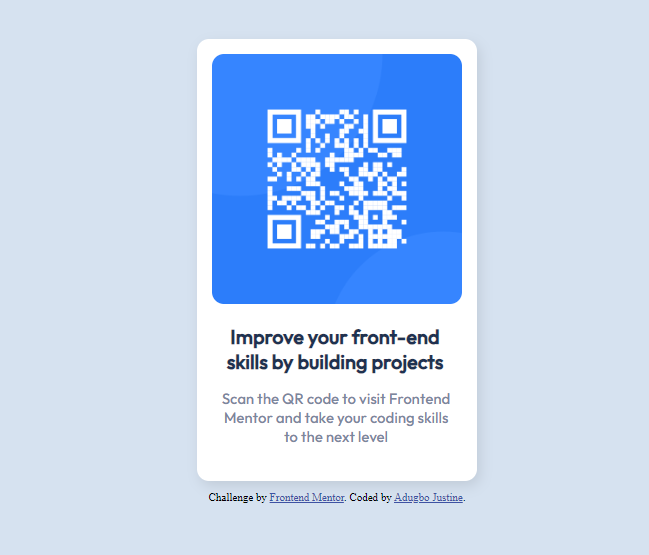

# Frontend Mentor - QR code component solution

This is a solution to the [QR code component challenge on Frontend Mentor](https://www.frontendmentor.io/challenges/qr-code-component-iux_sIO_H). Frontend Mentor challenges help you improve your coding skills by building realistic projects. 

## Table of contents

- [Frontend Mentor - QR code component solution](#frontend-mentor---qr-code-component-solution)
  - [Table of contents](#table-of-contents)
  - [Overview](#overview)
    - [Screenshot](#screenshot)
    - [Links](#links)
  - [My process](#my-process)
    - [Built with](#built-with)
    - [Continued development](#continued-development)
    - [Useful resources](#useful-resources)
  - [Author](#author)
  - [Acknowledgments](#acknowledgments)

## Overview

### Screenshot

### Links

- Solution URL: [Add solution URL here](https://your-solution-url.com)
- Live Site URL: [Add live site URL here](https://your-live-site-url.com)

## My process

### Built with

- Semantic HTML5 markup
- CSS custom properties
- Flexbox
- CSS Grid

### Continued development

I'm still not stable with the use of CSS GRID and FLEXBOX and I plan on developing my skill in this area because it was a bit challenging for me while doing the challenge.

### Useful resources

w3school
This coding site actually helped me while working on this project

## Author

- Frontend Mentor - [@justine1285](https://www.frontendmentor.io/profile/justine1285)
- Twitter - [@justine_mamus](https://www.twitter.com/justine_mamus)

## Acknowledgments

I want to give a big shoutout to Dave Gray and SuperSimpleDev. Their video tutorials really helped me alot. Thanks so much and i would continue working hard to be a better and more outstanding frontend dev
